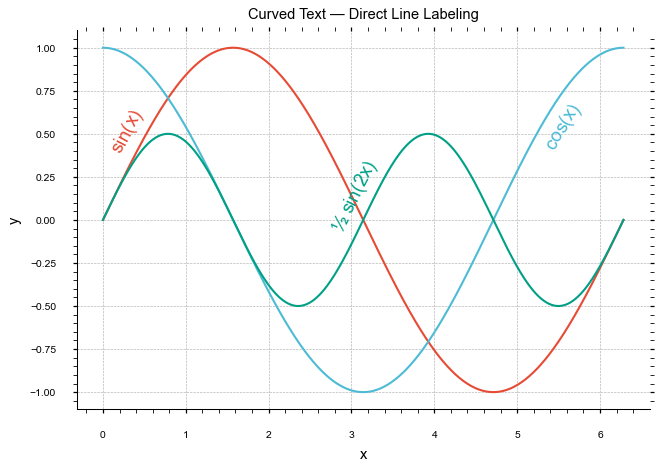

# Examples

---

## Basic usage

Apply a preset and save a publication-ready figure:

```python
import numpy as np
import matplotlib.pyplot as plt
import peerstyle

peerstyle.use_style('nature')

x = np.linspace(0, 10, 200)
fig, ax = plt.subplots(figsize=peerstyle.figsize('nature'))
ax.plot(x, np.sin(x), label='sin(x)')
ax.plot(x, np.cos(x), label='cos(x)')
ax.set_xlabel('x')
ax.set_ylabel('y')
ax.legend()
peerstyle.save(fig, 'figure.pdf')
```

---

## Stacking styles

Each modifier only changes what it specifically sets — everything else from the preset is preserved:

```python
# IEEE + CVD-safe colours + no LaTeX required
peerstyle.use_style(['ieee', 'bright', 'no-latex'])

# Nature + open axes + Jupyter-friendly sizes
peerstyle.use_style(['nature', 'despine', 'notebook'])

# Check that a figure reads correctly in black and white
peerstyle.use_style(['ieee', 'grayscale'])
```

---

## Context manager in notebooks

`style_context` restores all rcParams when the block exits — it never leaks into subsequent cells:

```python
with peerstyle.style_context('ieee', fontsize=9):
    fig, ax = plt.subplots(figsize=peerstyle.figsize('ieee'))
    ax.scatter(x, y, s=10)
    ax.set_xlabel('x')
    ax.set_ylabel('y')
    peerstyle.save(fig, 'scatter.pdf')

# matplotlib defaults are fully restored here
```

---

## Multi-panel figures

`figsize` scales correctly for any grid layout, keeping each panel at the right physical size for the journal:

```python
peerstyle.use_style('nature')

# Two side-by-side panels (each one column wide)
fig, (ax1, ax2) = plt.subplots(1, 2, figsize=peerstyle.figsize('nature', ncols=2))

# Two stacked panels
fig, (ax1, ax2) = plt.subplots(2, 1, figsize=peerstyle.figsize('ieee', nrows=2))

# Full double-column width, 2×2 grid
fig, axes = plt.subplots(2, 2, figsize=peerstyle.figsize('nature', double_col=True, nrows=2))
```

---

## Saving for different formats

```python
peerstyle.use_style('ieee')
fig, ax = plt.subplots(figsize=peerstyle.figsize('ieee'))
ax.plot(x, y)

# PDF for LaTeX inclusion
peerstyle.save(fig, 'figure.pdf')

# High-res PNG for online submission systems
peerstyle.save(fig, 'figure.png', dpi=300)

# SVG for web or Illustrator/Inkscape editing
peerstyle.save(fig, 'figure.svg')
```

!!! tip
    All bundled styles set `pdf.fonttype: 42` and `svg.fonttype: none`, so fonts stay as outlines in the exported file and remain editable in vector graphics editors.

---

## Curved text — direct line labeling

Label lines along their paths instead of using a legend:

```python
peerstyle.use_style(['nature', 'bright'])

x = np.linspace(0, 2 * np.pi, 400)

fig, ax = plt.subplots(figsize=peerstyle.figsize('nature'))
ax.plot(x, np.sin(x),     color='C0')
ax.plot(x, np.cos(x),     color='C1')
ax.plot(x, np.sin(2*x)/2, color='C2')

peerstyle.curved_text(ax, x, np.sin(x),     'sin(x)',     pos=0.10, offset=9,  color='C0')
peerstyle.curved_text(ax, x, np.cos(x),     'cos(x)',     pos=0.88, offset=-9, color='C1')
peerstyle.curved_text(ax, x, np.sin(2*x)/2, '½ sin(2x)', pos=0.52, offset=9,  color='C2')

peerstyle.save(fig, 'labeled_lines.pdf')
```



**Placement tips:**

- Spread `pos` values across the 0–1 range so labels land in different parts of the plot.
- Place labels at peaks or troughs where the curve is flat — the text reads more naturally when nearly horizontal.
- Use positive `offset` to place a label above the curve, negative to place it below.

---

## Inline rcParam overrides

Pass any convenience kwarg or raw rcParam key on top of a preset:

```python
# Common shortcuts
peerstyle.use_style('ieee', figsize=(5, 3), fontsize=9, linewidth=1.5)

# Raw rcParam key
peerstyle.use_style('nature', **{'axes.grid': False, 'legend.frameon': False})

# Mix both
with peerstyle.style_context('ieee', dpi=150, **{'lines.markersize': 4}):
    fig, ax = plt.subplots(figsize=peerstyle.figsize('ieee'))
    ax.plot(x, y, 'o-')
```

---

## Using with Seaborn

PeerStyle styles Matplotlib's rcParams, so they apply to any library that renders on Matplotlib axes:

```python
import seaborn as sns
import peerstyle

peerstyle.use_style(['nature', 'muted'])

# Axes-level functions return an Axes directly
ax = sns.lineplot(x=[0, 1, 2, 3], y=[0, 1, 0, 1])
peerstyle.save(ax.figure, 'seaborn_figure.pdf')

# Figure-level functions expose axes through .axes
g = sns.relplot(x='x', y='y', hue='group', data=df)
peerstyle.save(g.figure, 'seaborn_relplot.pdf')
```

---

## Using with Pandas

```python
import pandas as pd
import peerstyle

peerstyle.use_style(['ieee', 'bright'])

df = pd.DataFrame({'x': range(10), 'a': range(10), 'b': range(0, 20, 2)})
ax = df.plot(x='x', y=['a', 'b'])
peerstyle.save(ax.figure, 'pandas_figure.pdf')
```
