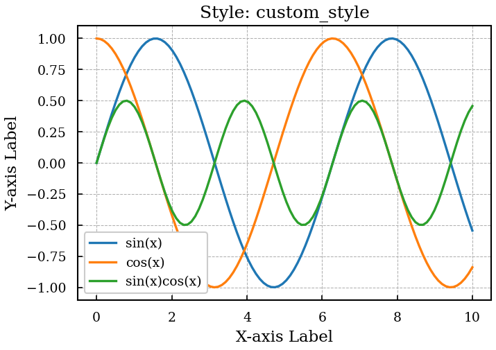
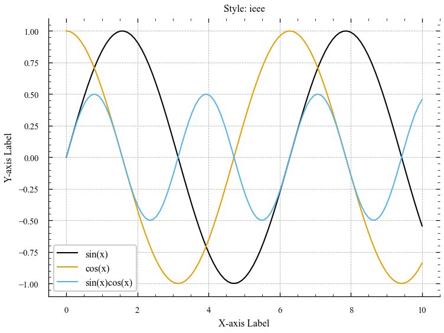
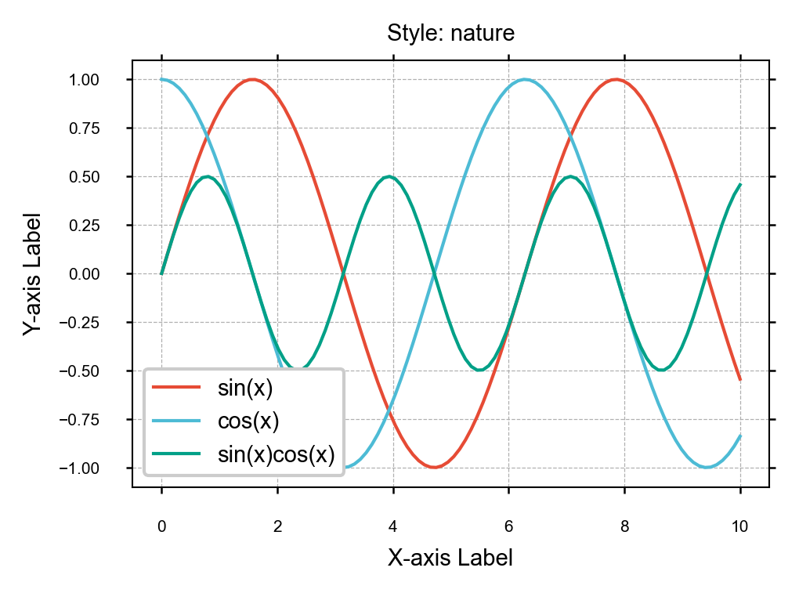
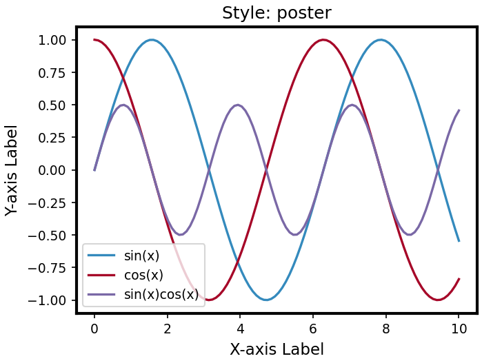
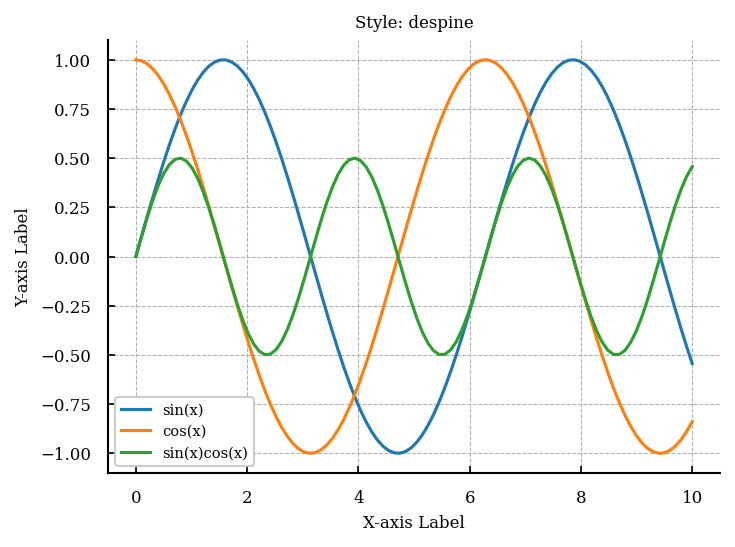
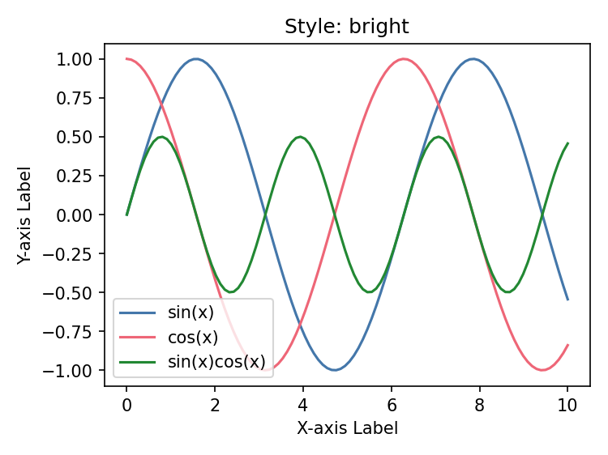
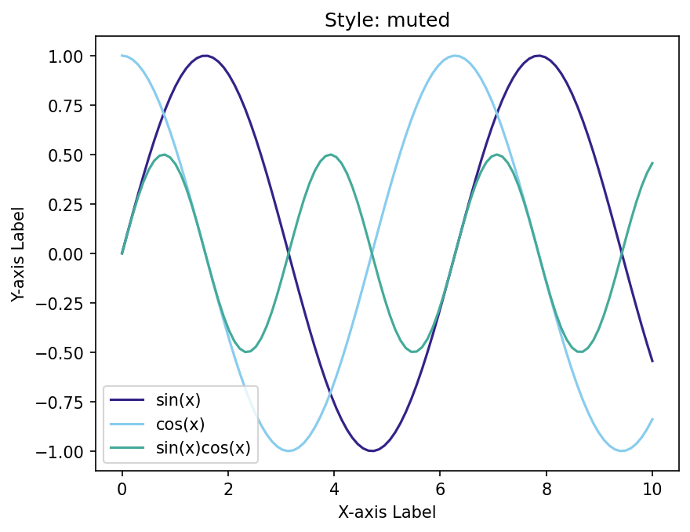
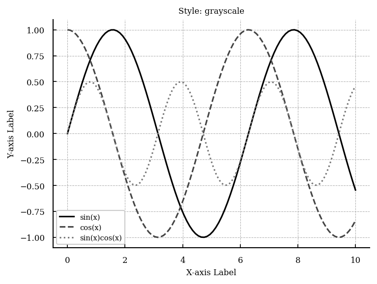

# Styles

PeerStyle has two kinds of styles: **presets** and **modifiers**.

- **Presets** are complete looks for a specific journal or context.
- **Modifiers** are focused, single-purpose tweaks designed to be layered on top.

Stack them freely:

```python
peerstyle.use_style(['ieee', 'bright', 'no-latex'])
```

All bundled styles are also registered with Matplotlib under a `peerstyle.` prefix on import, so they work anywhere a style name is accepted:

```python
import matplotlib.pyplot as plt
plt.style.use('peerstyle.nature')
plt.style.use(['peerstyle.ieee', 'peerstyle.muted', 'peerstyle.no-latex'])
```

---

## Presets

### `custom_style`

Default serif scientific style. LaTeX rendering enabled, 300 DPI, standard single-column width.



---

### `ieee`

IEEE journal guidelines. Times New Roman, 3.5 in single-column, inward ticks on all sides, minor ticks enabled, CVD-friendly color cycle.



---

### `nature`

Nature journal guidelines. Arial/Helvetica, 89 mm (3.5 in) column, outward ticks, compact font sizes matching Nature's submission requirements.



---

### `poster`

High-visibility style for conference posters. Large fonts, thick lines, vibrant colors.



---

## Modifiers

### `no-latex`

Disables LaTeX and switches to STIX fonts, which are visually close to Computer Modern. Use this on machines without a LaTeX install, or in any environment where `text.usetex: True` would fail.

```python
peerstyle.use_style(['ieee', 'no-latex'])
```

!!! note
    PeerStyle applies this fallback automatically when LaTeX is enabled but not found on the system.

---

### `despine`

Removes the top and right axis spines. Standard in biology, statistics, and data science.



```python
peerstyle.use_style(['nature', 'despine'])
```

---

### `notebook`

Bumps up font sizes and figure dimensions for Jupyter notebooks, where the default journal sizes are too small to read on screen. Also disables LaTeX.

```python
peerstyle.use_style(['nature', 'notebook'])
```

---

### `bright`

[Paul Tol's](https://personal.sron.nl/~pault/) CVD-safe bright colour palette — distinguishable by people with colour-vision deficiency.



```python
peerstyle.use_style(['ieee', 'bright'])
```

---

### `muted`

Paul Tol's CVD-safe muted colour palette. Softer than `bright`, better when you have many series.



```python
peerstyle.use_style(['nature', 'muted'])
```

---

### `grayscale`

Black and grey tones with varied linestyles. Use this to check monochrome readability or to meet journal requirements for B&W print.



```python
peerstyle.use_style(['ieee', 'grayscale'])
```
